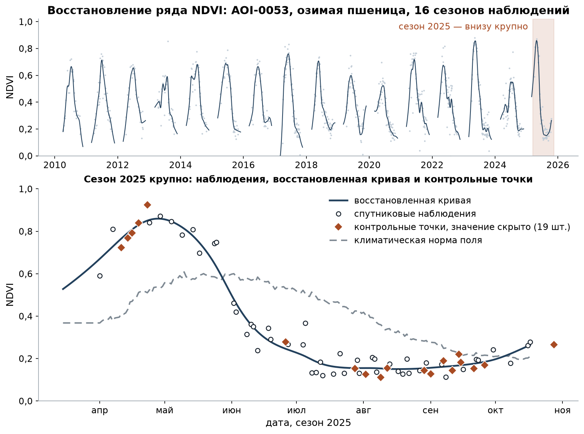
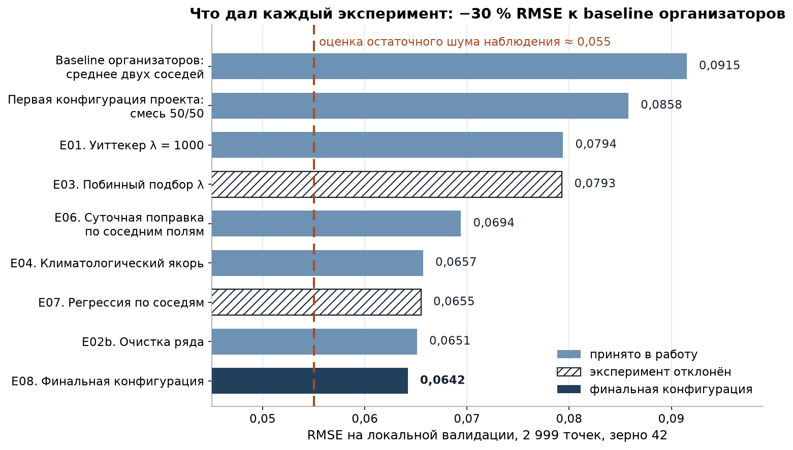
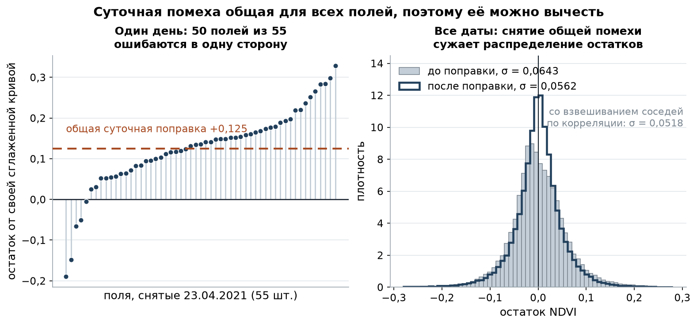
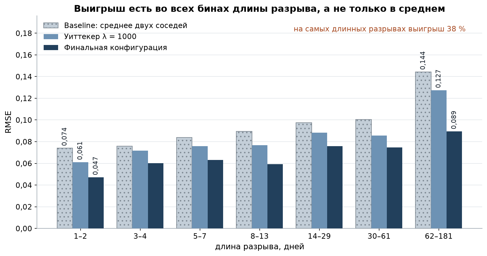
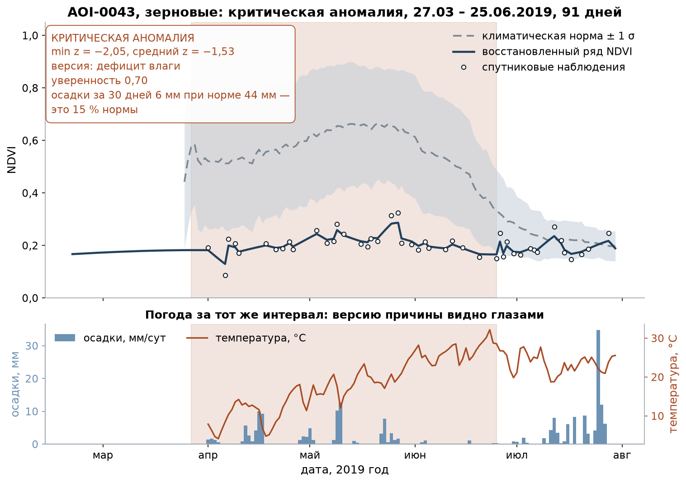
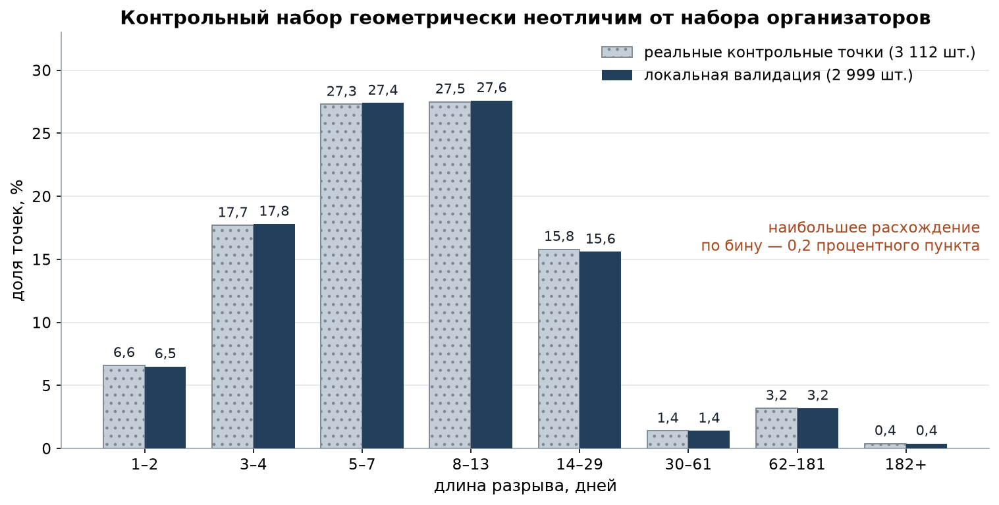

# 🌾 Фенолог

**Мониторинг вегетационной динамики полей: восстановление рядов NDVI, поиск периодов
угнетения растительности и объяснение их причины человеческим языком.**

Космохакатон, Ростов-на-Дону · кейс «Мониторинг вегетационной динамики»
Команда **CLV-DIGITAL**

---

## Эксперту: всё для проверки в одном месте

| Что | Где |
| --- | --- |
| 🌐 **Работающий сервис** | **https://fenolog.clv-digital.tech** |
| 📄 Файл ответа, второй тур | [`submission.csv`](submission.csv) — 2 323 строки, 20 полигонов |
| 📄 Файл ответа, первый тур | [`submission_round1.csv`](submission_round1.csv) — 3 112 строк, 78 полигонов |
| 📘 Исследовательский отчёт | [`reports/report.md`](reports/report.md) |
| 🧪 Журнал экспериментов | [`reports/experiments.md`](reports/experiments.md) — 24 записи, включая отклонённые гипотезы |
| 🧠 Обученные артефакты | [`models/`](models/) — бустинг, норма по культурам, определитель культуры |

### Результат на закрытом тесте

| | Локальная валидация | **Факт платформы** |
| --- | --- | --- |
| Первый тур (3 112 точек) | RMSE 0,0596 · GapScore 12,12 | **RMSE 0,0653 · GapScore 10,41** |
| Второй тур (2 323 точки) | — | **RMSE 0,0749 · GapScore 7,53** |

Локальная валидация оптимистична примерно на девять процентов, и мы об этом прямо
пишем: числа 0,0596 нигде не выдаются за ожидаемый результат. Ранжирование методов
она при этом предсказывает верно — проверено прогоном всех 140 методов по выданным
ответам первого тура.

### Запуск за две команды

```bash
docker compose up --build          # сервис на http://localhost:8000
```

```bash
# Файл ответа второго тура — ровно та команда, которой собран поданный submission.csv
python -m src.cli.batch_infer --input data/test_features.csv     --extra-history --value-column true --output submission.csv
```

Результат второго тура воспроизводится **побитово**: два запуска дают файл с
точностью до последнего знака. Готовая модель подхватывается из `models/`,
переобучение не требуется — весь прогон около полутора минут.

**Файл первого тура нынешней моделью не воспроизводится**, и это надо сказать
прямо. Он собран до того, как организаторы выдали ответы; после выдачи модель
переобучена с их участием (см. «Про файл ответов» ниже). Команда первого тура
рабочая и даст корректный файл, но не тот же самый — расхождение около 0,015.
`submission_round1.csv` в репозитории — именно поданный тогда файл, тот, что дал
0,0653.

### Где что искать по критериям оценки

| Критерий | Где смотреть |
| --- | --- |
| Восстановление ряда, метрика | `src/ml/`, метод `e05_lgbm`; протокол — `python -m src.ml.validate` |
| Детекция аномалий и причина | `src/core/anomaly.py`, `src/core/analyze.py`; в сервисе — раздел «Карта», выбрать поле |
| Автоматический сбор данных | `src/providers/` — снимки, погода, контуры, соседние поля |
| Работа по регионам | раздел «Карта» → выбор региона; в командной строке `python -m src.cli.region` |
| Управление участками | раздел «Участки»: сохранение, переименование, культура, пересчёт, удаление |
| Отчёт для неспециалиста | раздел «Отчёты» → кнопка «Отчёт PDF» |
| Воспроизводимость | этот раздел, плюс «Воспроизводимость» ниже |

---

## Задача

Спутник снимает поле не каждый день, а снятое часто закрыто облаками. В результате
ряд вегетационного индекса NDVI дырявый: пропуски тянутся от одного дня до полугода.
По такому ряду нельзя ни отследить фазы развития культуры, ни заметить, что поле
начало угнетаться.

«Фенолог» восстанавливает пропуски, сравнивает ряд с климатической нормой поля и
находит периоды, когда растительность устойчиво ниже нормы, — с версией причины.

## Что делает

1. **Собирает данные сам.** По рамке карты находит контуры сельхозполей
   (OpenStreetMap), по выбранному контуру скачивает снимки Sentinel-2, Landsat и
   MODIS и суточную метеосводку за всю доступную историю. Ручная загрузка датасета
   не нужна. Замер на живом поле под Ростовом: 453 наблюдения за 6 сезонов и
   1 979 суток погоды; по одной рамке карты — 80 контуров, 5 695 га, невалидных
   геометрий ноль.
2. **Восстанавливает ряд.** Заполняет пропуски от одного дня до полугода.
3. **Считает норму.** Для каждого дня года — по собственной истории поля, а если
   истории нет, по типу культуры.
4. **Находит аномалии.** Выделяет периоды ниже нормы и классифицирует их: штатное
   развитие, угнетение биомассы, критическая аномалия.
5. **Объясняет причину.** Не «аномалия обнаружена», а готовая фраза для агронома:

> «Осадков 41 мм при норме 62 мм (67 процентов), температура отличается от нормы
> на 0.1 градуса — ни засухи, ни жары, ни холода, ни переувлажнения за эти 45 дней
> не было. Погода отклонение не объясняет: проверяйте агротехнику, состояние семян,
> болезни и вредителей.»

6. **Прогнозирует развитие до конца сезона.** Вперёд переносится не сам индекс, а
   отклонение от нормы, затухающее с характерным временем 20 дней. Проверено на
   2 010 ретроспективных срезах и 34 925 парах «прогноз — факт»: RMSE 0,0947 на
   первой неделе против 0,1140 у «останется как сейчас» и 0,1488 у «просто нормы».
   На всех горизонтах до 30 дней прогноз обгоняет оба наивных варианта, хуже них не
   бывает нигде. Интервал заявлен 80-процентным, измеренное покрытие 0,803.
7. **Оценивает поле как объект риска.** Балл 0…100, буква A…E и разбор по сезонам —
   для страховой компании и банка, кредитующего хозяйство. Балл считается по
   сезонам 2010–2019 и проверяется по поведению поля в 2020–2024: против межгодового
   разброса урожая ρ = −0,63, против глубины худшего провала ρ = +0,46.
8. **Связывает просадки с журналом полевых работ.** Хозяйство передаёт, что и когда
   делал на поле, и версия «причина не погодная» перестаёт быть тупиком: «гербицид
   внесён за девять дней до начала просадки, вероятна фитотоксичность» или «в
   периоде стоит уборка, падение плановое». На AOI-0002 журнал дополнил 9 периодов
   из 22.
9. **Отдаёт отчёт для неспециалиста.** Всё перечисленное выше сервис показывает
   языком метрик — это язык эксперта. Кнопка «Отчёт PDF» собирает тот же анализ
   заново для того, кто в теме не разбирается: фермера, агронома, оценщика банка
   или страховой. Шесть разделов — вердикт одной фразой, история наблюдений со
   словариком, найденные периоды карточками, оценка поля, прогноз и объяснение
   того, как всё считается, без единой формулы. Ни z-оценок, ни сигм: вместо
   «z = −2,99» там написано «намного ниже обычного».



---

## Результат

Качество восстановления измеряется RMSE на скрытых значениях NDVI и производным от
неё баллом `GapScore = 30 · max(0, 1 − RMSE / 0.1)`.

| Конфигурация | RMSE | GapScore |
| --- | ---: | ---: |
| Среднее двух ближайших наблюдений (базовое решение) | 0,0888 | 3,35 |
| Линейная интерполяция | 0,0880 | 3,60 |
| Сглаживание Уиттекера, λ = 1000 | 0,0794 | 6,17 |
| Лучшая конфигурация без обучения | 0,0642 | 10,75 |
| **Итоговая конфигурация: градиентный бустинг над методами** | **0,0596** | **12,12** |

**Минус 32,9 % ошибки.** Результат воспроизведён на трёх независимых разбиениях
(0,0596 / 0,0597 / 0,0638) — он не привязан к одному удачному контрольному набору.



---

## Главная идея

Считалось, что точность упирается в собственный шум наблюдения (около 0,066) и ниже
RMSE 0,075 опуститься нельзя. **Это неверно.**

Шум наблюдения не независим между полями. Дымка, тонкое облако, угол Солнца и
поправки атмосферной коррекции сдвигают NDVI сразу у всех полей, снятых одним
пролётом спутника. А наблюдения **соседних** полей на дату пропуска доступны —
неизвестно только целевое поле.

Значит общую суточную помеху можно измерить по соседям и вычесть.



Слева — один день: 50 полей из 55 промахиваются мимо своей сглаженной кривой в одну
и ту же сторону. Справа — что даёт снятие этой помехи на всех датах: разброс
остатка падает с 0,0643 до 0,0562, а при взвешивании соседей по корреляции — до
0,0518.

Один этот приём дал больше, чем все остальные вместе: **0,0794 → 0,0694**.

---

## Арбитр над методами

Ни один способ восстановления не лучший везде: на коротких пропусках выигрывает
слабое сглаживание, на длинных — климатологический якорь. Поэтому поверх всех
методов работает градиентный бустинг: он получает их предсказания, расстояния до
ближайших наблюдений, плотность съёмки, климатическую норму, погоду и — что
оказалось важнее всего — **меры неопределённости**: разброс между методами, число
соседних полей на эту дату, изменчивость наблюдений в окне.

Показательная деталь: модель, которая видит только контекст и **вообще не видит**
предсказаний методов, даёт 0,0635 — уже лучше любого отдельного метода. То есть
значительная часть решения — это понимание, где данным можно доверять.

Главный рычаг оказался не в настройке модели, а в объёме обучающих данных:
дополнительный контрольный набор, построенный теми же шаблонами пропусков поверх
исторических лет, дал −0,0020, тогда как весь перебор гиперпараметров — −0,0006.

## Как устроено восстановление

```
1. очистка ряда
     бракованные значения придавливаются к границе диапазона, а не выбрасываются
     мягкий медианный фильтр по календарному окну ±8 дней
     веса наблюдений по сенсору: Sentinel-2 / Landsat / MODIS = 1 / 0,8 / 0,5
2. суточная поправка по соседним полям
     вес соседа max(corr, 0,1)³ по корреляции остатков
3. сглаживание Уиттекера, λ = 500
4. на пропусках от 45 дней — климатологический якорь
     восстанавливается отклонение от нормы, а не сам NDVI
```

Выигрыш есть **во всех** диапазонах длины пропуска, а не только в среднем:



---

## Поиск аномалий

Периоды выделяются по отклонению от климатической нормы в единицах её разброса,
близкие периоды склеиваются, короткие выбросы отсеиваются. Версия причины
выбирается по погоде за тот же интервал.



Согласие с эталонной разметкой на 30 520 размеченных наблюдениях:

| Показатель | Было | Стало |
| --- | ---: | ---: |
| Точность классификации | 0,916 | **0,938** |
| F1 «Угнетение биомассы» | 0,703 | **0,773** |
| F1 «Критическая аномалия» | 0,517 | **0,637** |
| Доля периодов, попадающих в разметку | 0,927 | **0,991** |

**Шесть версий причины:** дефицит влаги, температурный стресс, переувлажнение,
резкое одномоментное событие, затяжной холод и «причина не погодная» — последняя не
заглушка, а утверждение: все погодные пороги проверены и ни один не сработал. Если
подан журнал полевых работ, «причина не погодная» перестаёт быть тупиком и
дополняется конкретной работой.

**Две ошибки ядра, которые вылезли только на живых данных.** Обе на подготовленном
наборе не проявлялись вовсе.

1. Нижняя граница разброса нормы поднята с 0,02 до 0,05. Прежнее значение давало на
   полях с короткой историей z-оценки до −25: норма по двум прошлым сезонам
   описывает другую культуру севооборота, и отклонение делится почти на ноль. Новая
   граница обоснована физикой: собственный шум одного наблюдения NDVI равен 0,066, и
   норма, построенная из тех же наблюдений, не может быть втрое точнее измерения.
2. Периоды теперь ищутся только в вегетационный сезон. Без этого фильтра сервис
   объявлял критическую аномалию в январе — на поле, где просто лежал снег. Сам ряд
   и z-оценка за зиму остаются в ответе, скрывается только поиск событий.

Согласие с эталонной разметкой при обеих правках держится на **0,9417 на 6 282
точках** — правки убирают ложные срабатывания там, где эталонной разметки нет вовсе.

---

## Что получилось на закрытом тесте

Организаторы выдали истину по 3 112 контрольным точкам первого теста, поэтому
здесь не оценка, а факт.

| | Локальная валидация | Закрытый тест |
| --- | --- | --- |
| Первый тур, RMSE | 0,0596 | **0,0653** |
| Первый тур, GapScore | 12,12 | **10,41** |
| Второй тур, RMSE | — | **0,0749** |
| Второй тур, GapScore | — | **7,53** |

Второй набор оказался тяжелее первого, и мы не выдаём за причину то, что ею не
является. Три гипотезы проверены измерением: эпоха съёмки (до 2017 года нет
Sentinel-2) даёт разницу 0,0010 и отклонена; достроенная нами климатология не
стоит ничего; более широкие разрывы объясняют 11 % разницы. Остальные 89 %
остаются необъяснёнными — подробности в E23 журнала экспериментов.

Локальная валидация оптимистична примерно на девять процентов. Это честная цена
того, что контрольные точки мы прятали сами: как ни копируй геометрию настоящих
разрывов, спрятанное значение остаётся в ряду соседей.

**Но ранжирование методов она предсказала верно.** Прогон всех 140 методов без
обучения по настоящим ответам сохранил порядок: базовое решение осталось
последним, финальная сборка — третьей, а поданный файл обошёл лучший метод без
обучения на 0,0036. Отсюда правило, которого мы держались: числа локальной
валидации годятся для сравнения методов между собой и не годятся как обещание
результата. Подробности — E18 в журнале экспериментов.

## Как это проверялось

Все решения принимались по локальной валидации, и её корректность пришлось
доказывать отдельно.

Наивное «спрятать 20 % случайных значений» не годится: у случайной точки пропуск
почти всегда короткий, а в реальных данных встречаются разрывы до 189 дней, и
именно на них методы расходятся. Поэтому контрольные точки скрываются **по шаблонам
настоящих**: из данных снимается геометрия каждого реального пропуска (расстояние до
соседа слева, справа, месяц) и воспроизводится на известных значениях.



Расхождение с реальным распределением — не больше 0,2 процентного пункта по любому
диапазону. Разбиение — GroupKFold по полям: поле целиком либо в обучении, либо в
контроле. У скрытых точек стираются **все** признаки, а не только целевой, — ровно
так замаскированы настоящие контрольные точки.

Это не формальность. **Первая версия протокола давала другое ранжирование методов**,
и решение, принятое по ней, увело бы всю работу не туда. Разбор — в отчёте.

---

## Данные

Решение работает с двумя источниками: подготовленным набором для офлайн-проверки и
живыми открытыми API для веб-сервиса.

**Подготовленный набор** (лежит в `data/`, используется техническим режимом):

| Файл | Строк | Что внутри |
| --- | --- | --- |
| `data/private_features.csv` | 57 185 | Тестовый набор: 78 полигонов, 3 112 контрольных точек с `is_synthetic_gap = True` |
| `data/train_dataset.csv` | 99 955 | Обучающий набор: 39 полигонов, сезоны 2010–2024 |
| `data/test_features.csv` | 49 190 | Второй тестовый набор: 20 полигонов, 2 323 контрольные точки, сезоны 2010–2024 |
| `data/private_test_ground_truth.csv` | 3 112 | **Ответы организаторов на первый тур**, выданные командам после первой волны проверки |

Одна строка — пара «полигон + дата». Признаки: индексы Sentinel-2, Landsat и MODIS
(`s2_ndvi`, `s2_evi`, `s2_ndwi`, `landsat_*`, `modis_*`), метеоданные ERA5
(`era5_temp_c`, `era5_precip_mm`), календарь (`year`, `doy`), склеенный по приоритету
сенсоров `primary_ndvi`, климатическая норма (`ndvi_climatology_mean`,
`ndvi_climatology_std`, `n_reference_years`) и статичный `crop_type`. В обучающем
наборе дополнительно есть `ndvi_zscore` и `status`, которых в тестовом нет.

**Про файл ответов и почему он попал в обучение.** После первой волны проверки
организаторы выдали всем командам истину по 3 112 контрольным точкам первого тура
(`data/private_test_ground_truth.csv`). Это розданные данные, а не подсмотренные,
и мы используем их двумя способами — оба стоит назвать прямо.

Первое — **измерили себя**: сравнили поданный файл с истиной и узнали фактический
результат 0,0653 против локальной оценки 0,0596. Отсюда правило не называть
локальные числа ожидаемым результатом.

Второе — **добавили как обучающие строки** (`_real_labelled_rows` в
`src/ml/m_e05_lgbm.py`). Проверка честная: разбиение по полигонам, модель не видит
поля, на котором её меряют; прирост измерен парно, 0,0650 → 0,0643.

Чего мы **не** делали: не выбирали по этим ответам конфигурацию. Метод `e05_lgbm`
выбран локальной валидацией ещё до выдачи файла, и когда прогон всех 140 методов
по настоящим ответам показал другого лидера среди методов без обучения, мы ничего
не поменяли — это была бы подгонка под тест.

**Предупреждение о числах.** Если пересобрать файл первого тура нынешней моделью и
померить его по этим же ответам, выйдет RMSE 0,0442. Это **утёкшее число и оно
недействительно**: ответы входят в обучение. Честные числа по первому туру —
0,0596 (локальная оценка, до выдачи ответов) и 0,0653 (факт платформы). По второму
туру результат 0,0749 целиком со стороны платформы, его ответов у нас нет.

В контрольных строках замаскированы **все** динамические и вычисляемые признаки, а
не только целевой: опираться можно лишь на соседние даты, статичные поля и другие
полигоны.

**Живые источники** (используются веб-сервисом и командами `demo` / `region`, ручная
загрузка данных не требуется):

| Источник | Что даёт | Отклик | Роль |
| --- | --- | ---: | --- |
| Microsoft Planetary Computer | Sentinel-2 L2A, Landsat C2 L2, MODIS 13Q1 | 0,8 с | основной каталог снимков |
| AWS Element84 Earth Search | Sentinel-2 L2A в COG | 1,3 с | запасной каталог |
| Open-Meteo Archive | суточная температура и осадки, реанализ ERA5-Land | 0,5 с | погода |
| Overpass (OpenStreetMap) | контуры сельхозугодий | 0,5 с | поиск полей в рамке карты |
| Copernicus Data Space (ЕКА) | каталог Sentinel-2 | 0,7 с | по ключу, см. ниже |

Open-Meteo раздаёт тот же реанализ ERA5, из которого собраны колонки `era5_temp_c` и
`era5_precip_mm` подготовленного набора: живые данные и офлайн-набор физически
однородны.

**Copernicus Data Space проверен и не сделан основным путём.** Каталог ЕКА открыт,
но все три пути к пикселям требуют регистрации: `s3://eodata/...` отвечает
`InvalidCredentials` без ключа объектного хранилища, `alternate.https` без токена
OIDC отдаёт `401 DAT-ZIP-604`, OData-ссылка — тот же 401. Плюс данные лежат в
SAFE/JPEG2000, а не в COG. Источник оставлен в коде и включается переменными
`CDSE_S3_ACCESS_KEY`/`CDSE_S3_SECRET_KEY` либо `CDSE_USERNAME`/`CDSE_PASSWORD`; без
них уступает очередь Planetary Computer. **Google Earth Engine не используется**: он
требует собственного проекта в Google Cloud и авторизации владельца аккаунта — ключ
в репозиторий не положишь, и решение перестало бы быть воспроизводимым.

Точные идентификаторы коллекций, маски облаков и параметры запросов — в
`src/providers/satellite.py`, разбор — в разделе 7 отчёта.

---

## Запуск

### Подготовка окружения

```bash
git clone https://github.com/dimon0804/FENOLOG.git
cd FENOLOG
python -m venv .venv && . .venv/bin/activate     # Windows: .venv\Scripts\activate
pip install -r requirements.txt
```

Python 3.12. Отдельно ставить системные библиотеки не нужно: `rasterio`, `shapely`
и `pyproj` приезжают колёсами с уже вшитыми GDAL, GEOS и PROJ. В контейнере
доставляются только `ca-certificates` (проверка TLS при обращении к источникам),
`libexpat1` и `curl` (для `healthcheck`) — они перечислены в `Dockerfile`.

### Восстановление пропусков и файл ответа

Организаторы выдавали два тестовых набора, и формат посылки у них отличается
именем колонки значения. Обе команды ниже рабочие.

**Второй тур** (`data/test_features.csv`, 20 полигонов, 2 323 контрольные точки) —
именно этой командой собран поданный файл:

```bash
python -m src.cli.batch_infer     --input data/test_features.csv     --extra-history --value-column true     --output submission.csv
```

**Первый тур** (`data/private_features.csv`, 78 полигонов, 3 112 контрольных точек):

```bash
python -m src.cli.batch_infer --method e05_lgbm --output submission_round1.csv
```

Колонки: `anon_polygon_id, date` и значение — `primary_ndvi_true` во втором туре,
`primary_ndvi_pred` в первом. Разница только в имени, содержимое одинаковое;
переключается флагом `--value-column`. Путь к файлу меняется флагом `--output`.

Флаг `--extra-history` дополняет ряды наблюдениями тех же полей из ранее выданного
файла: второй набор обрывается на октябре 2024 года, а первый содержит те же
двадцать полей ещё и за 2025-й. Проверено, что ни одна добавленная строка не
совпадает с контрольной точкой второго теста.

Готовая обученная модель лежит в репозитории (`models/e05_lgbm.pkl`) и подхватывается
автоматически: отдельная команда обучения не нужна, весь прогон занимает около
полутора минут. Обучение с нуля запускается тем же вызовом при отсутствии файла
модели, а принудительно — флагом `--retrain`; это примерно 11 минут.

Результат воспроизводится побитово: два запуска дают файл с точностью до последнего
знака. Это стоило отдельной починки — подробности в журнале экспериментов, E17.

Запасной вариант без обучения — за полторы секунды и без файла модели:

```bash
python -m src.cli.batch_infer --method final
python -m src.cli.batch_infer --list-methods    # все доступные методы
```

### Детекция аномалий на подготовленном наборе

```bash
python -m src.cli.detect --polygon AOI-0001              # разбор одного поля
python -m src.cli.detect --all --output reports/anomalies.csv
python -m src.cli.detect --polygon AOI-0043 --json       # полный ответ ядра
```

Печатает найденные периоды: даты, длительность, класс, версию причины и готовую
формулировку. Ряд берётся из CSV. На всём наборе находит 367 периодов по
65 полигонам.

### Сквозной сценарий на живых данных: одно поле

```bash
python -m src.cli.demo --bbox 39.60 47.10 39.90 47.30              # что есть в рамке
python -m src.cli.demo --bbox 39.60 47.10 39.90 47.30 --analyze 1  # разобрать поле №1
python -m src.cli.demo --polygon-file my_field.geojson             # свой контур
python -m src.cli.demo --bbox 39.6 47.1 39.9 47.3 --analyze 1 --years 6 --output out.json
```

То же, что делает веб-сервис, только в терминале, и **без подготовленного датасета**:

1. находит сельхозконтуры в указанной рамке карты через OpenStreetMap;
2. по выбранному контуру сам скачивает снимки трёх спутников и погоду;
3. восстанавливает ряд и считает климатическую норму;
4. находит периоды угнетения и объясняет их причину.

Печатает диагностику сбора (сколько наблюдений по каждому сенсору, сколько суток
погоды, что не удалось), затем найденные периоды с готовыми формулировками. Первый
прогон по полю долгий — скачиваются сцены; повторный идёт из кэша. Флаг
`--max-scenes` ограничивает число сцен для быстрой демонстрации.

Команда нужна по двум причинам. Во-первых, это проверка, что автосбор работает на
**произвольном регионе**, а не только на выданном наборе полигонов. Во-вторых, это
запасной путь демонстрации: если на площадке ляжет интерфейс, сценарий показывается
отсюда.

### Пакетный разбор региона: сотни полей за один запуск

```bash
python -m src.cli.region --list-regions                      # доступные пресеты
python -m src.cli.region --region rostov --fields 50
python -m src.cli.region --region krasnodar --fields 300 --years 6
python -m src.cli.region --bbox 39.6 47.1 39.9 47.3 --fields 20 --output reports/region.json
```

Разбор одного поля отвечает на вопрос агронома. Этот режим отвечает на вопрос
страховой компании и банка: **где в районе проблемы**. По каждому полю печатается
вердикт — «в норме», «под наблюдением», «требует выезда» или «данных мало», — а
сверху сводка: сколько полей и гектаров в каждом состоянии, список полей, требующих
внимания, и объяснение по худшему из них.

Класс «данных мало» выделен намеренно: если норма покрывает меньше половины ряда,
отсутствие аномалий означает «не знаем», а не «всё хорошо», и выдавать одно за другое
нельзя — на этой цифре принимается решение о страховании.

Восемь пресетов покрывают Южный федеральный округ (`rostov`, `krasnodar`,
`stavropol`, `volgograd`, `astrakhan`, `adygea`, `kalmykia`, `crimea`), рамки взяты
по земледельческим районам. Вместо пресета можно задать любую рамку через `--bbox`.
Флаг `--output` сохраняет сводку в JSON вместе с геометрией каждого поля — файл
можно отдать прямо на карту. Первый прогон по региону долгий, повторный по тому же
региону идёт из кэша за секунды.

### Сравнение методов восстановления

```bash
python -m src.ml.validate                     # полный прогон, ~2 минуты
python -m src.ml.validate --seed 7            # другое разбиение
python -m src.ml.validate --no-save --only final e05_lgbm whit1000
```

### Графики отчёта

```bash
python notebooks/figures.py                   # -> reports/figures/*.png
```

### Веб-интерфейс

```bash
docker compose up
# открыть http://localhost:8000
```

Подробно — стек, переменные окружения, источники данных, обработка отказов и
список эндпоинтов — в разделе [«Запуск сервиса»](#запуск-сервиса).

---

## Воспроизводимость

Всё, что влияет на результат, зафиксировано явно.

**Случайность.** Единственный источник случайности — построение локального
контрольного набора, зерно `42` (константа `SEED` в `src/ml/holdout.py`). Протокол
детерминирован: повторный запуск даёт те же 2 999 контрольных точек. Устойчивость
всех принятых решений проверялась на зёрнах `7` и `2026`, числа приведены в отчёте.

**Ключевые гиперпараметры итоговой конфигурации:**

| Параметр | Значение | Где задан |
| --- | --- | --- |
| Сглаживание Уиттекера, λ | 500 | `src/ml/m_e02_clean.py` |
| Порядок разности | 2 | `src/core/restore.py` |
| Медианный фильтр: окно / порог | ±8 дней / 0,20 | `src/ml/m_e02_clean.py` |
| Веса наблюдений по сенсору | 1 / 0,8 / 0,5 | `src/ml/m_e02_clean.py` |
| Вес соседа в суточной поправке | `max(corr, 0,1)³` | `src/ml/m_e06_sibling.py` |
| Подрезка остатков | [−0,15; +0,25] | `src/ml/m_e06_sibling.py` |
| Порог включения климатологического якоря | 45 дней | `src/ml/m_e08_final.py` |
| Доля якоря | 0,5 | `src/ml/m_e08_final.py` |
| Окно климатической нормы по дню года | ±8 дней, без текущего года | `src/core/climatology.py` |
| Пороги классов аномалий по z | −1 и −2 | `src/contracts.py` |
| Склейка периодов / минимальная длительность | 10 дней / 5 дней | `src/core/anomaly.py` |
| Реплик расширенного обучающего набора | 5 | `src/ml/m_e05_lgbm.py` |
| Нижняя граница разброса нормы | 0,05 | `src/core/climatology.py` |
| Вегетационный сезон для поиска периодов | апрель–октябрь | `src/core/analyze.py` |
| Время затухания отклонения в прогнозе | 20 дней | `src/core/forecast.py` |
| Множитель полуширины интервала / уровень | 1,10 / 0,80 | `src/core/forecast.py` |
| Пороги классов риска по отклонению | −7 % и −20 % | `src/core/forecast.py` |
| Веса компонент оценки риска | 0,35 / 0,35 / 0,20 / 0,10 | `src/core/scoring.py` |
| Границы букв A…E | 76 / 69 / 60 / 48 | `src/core/scoring.py` |
| Окна лагов журнала работ | 3–14 / 7–21 / 7 дней | `src/core/agrolog.py` |
| Доля годных пикселей в контуре | 0,20 | `src/providers/satellite.py` |
| Классы SCL Sentinel-2, идущие в брак | 0, 1, 3, 8, 9, 10, 11 | `src/providers/satellite.py` |
| Биты `qa_pixel` Landsat, идущие в брак | 0, 1, 2, 3, 4, 5 | `src/providers/satellite.py` |
| Срок жизни кэша внешних ответов | 30 суток | `src/providers/cache.py` |

**Протокол оценки** описан в `reports/experiments.md`, раздел «Протокол локальной
валидации»: как строится контрольный набор, почему именно так, чем это проверено.

**Версии зависимостей** зафиксированы в `requirements.txt`.

**Внешние данные и модели.** Сторонних предобученных моделей и закрытых наборов
данных решение не использует: все три артефакта обучены на данных этого
репозитория и пересобираются командами.

| Артефакт | Что это | Чем пересобрать |
| --- | --- | --- |
| `models/e05_lgbm.pkl` | бустинг-арбитр над методами восстановления | `python -m src.cli.batch_infer --method e05_lgbm --retrain --save-model` |
| `models/crop_climatology.json` | норма по типам культур для полей без своей истории | `python -m src.cli.build_artifacts --only climatology` |
| `models/crop_classifier.pkl` | определитель культуры по форме сезонной кривой | `python -m src.cli.build_artifacts --only classifier` |

Обе команды `build_artifacts` можно запустить разом: `python -m src.cli.build_artifacts`.
Проверено, что пересобранная норма по культурам побитово совпадает с той, что
лежит в репозитории.

**Про источники контуров полей.** Постановка называет рядом с OpenStreetMap ещё
ESA WorldCereal. Контуры мы берём только из OpenStreetMap, и вот почему:
WorldCereal — это растровая маска пахотных земель с шагом 10 метров, в ней два
значения и нет объекта «поле»; смежные участки в ней слиты в один массив.
Чтобы получить оттуда границу конкретного поля, нужна векторизация маски и
разделение смежных полей — работа, сопоставимая со всем слоем сбора данных.
OpenStreetMap отдаёт готовые замкнутые контуры с идентификатором, по которому
поле узнаётся при повторном заходе.

**Но WorldCereal в решении используется — как независимая проверка.** Публичный
TiTiler проекта Terrascope считает зональную статистику по произвольному контуру
без ключа и регистрации, и мы спрашиваем у него долю пашни внутри поля. Это
четвёртый канал проверки координат наравне со спутниковым снимком и картой:

```bash
python -m src.cli.verify --lon 39.31 --lat 47.30 --side 600
```

На поле под Ростовом маска даёт 97 % пашни, на Цимлянском водохранилище — 0 %,
в центре Москвы — 0,8 %. Это закрывает известную слабость проверки по снимку:
мелкий пруд по вегетационному индексу от поля не отличается, а в маске пашни
вода — ноль.

Ограничение названо честно: продукт покрывает только однолетние культуры, поэтому
виноградники под Анапой дают 0,049, а сады под Крымском — 0,000. Настоящие
угодья маска называет непашней по определению, и потому она умеет только
подтверждать, а возразить в одиночку не может.

**Соответствие идентификаторов коллекций.** Постановка перечисляет коллекции в
именах Google Earth Engine, мы берём те же данные через STAC-каталог Microsoft
Planetary Computer:

| В постановке (GEE) | У нас (Planetary Computer) |
| --- | --- |
| `COPERNICUS/S2_SR_HARMONIZED` | `sentinel-2-l2a` |
| `LANDSAT/LC08/C02/T1_L2`, `LANDSAT/LE07/...` | `landsat-c2-l2` |
| `MODIS/061/MOD13Q1` | `modis-13Q1-061` |
| `ECMWF/ERA5_LAND/DAILY_AGGR` | Open-Meteo Archive (переанализ ERA5) |

Почему не Google Earth Engine: доступ к нему требует проекта в Google Cloud и
учётной записи с подтверждённым доступом, то есть эксперт не сможет запустить
решение, не заведя себе аккаунт. Planetary Computer отдаёт те же коллекции по
анонимному STAC-запросу с подписью ссылок, и решение запускается у любого.

**Маскирование облаков, агрегация по полигону и параметры обращения к внешним API**
относятся к слою автоматического сбора данных: константы перечислены в таблице выше,
обоснование каждой — в докстрингах `src/providers/satellite.py` и в разделе 7 отчёта.
По контуру берётся медиана годных пикселей, а не среднее; даты с несколькими
сенсорами склеиваются по приоритету Sentinel-2 → Landsat → MODIS — тому же, по
которому собран `primary_ndvi` в наборе организаторов.

**Сеть.** Команды `demo` и `region` ходят в открытые API без ключей. Ответы кладутся
в файловый кэш `data/cache/`, срок жизни 30 суток; повторный прогон по тому же полю
или региону идёт из кэша (замеренное ускорение: погода ×102, контуры ×1510). Кэш
сносится обычным `rm -rf data/cache`.

---

## Запуск сервиса

Веб-сервис — вторая точка запуска решения. Он не требует ни заранее
подготовленного датасета, ни ручной загрузки файлов: пользователь указывает
регион на карте, сервис сам находит сельхозконтуры, сам забирает спутниковые и
метеоданные и сам строит разбор.

### Одной командой

```bash
git clone https://github.com/dimon0804/FENOLOG.git && cd FENOLOG
docker compose up
# открыть http://localhost:8000
```

Первая сборка занимает несколько минут: собирается интерфейс и ставятся
зависимости. Дальше запуск мгновенный. Проверка с чистого листа:

```bash
docker compose down -v && docker compose up --build
```

`docker compose up` не мешает техническому режиму — обе точки запуска
воспроизводятся из того же образа:

```bash
docker compose run --rm fenolog python -m src.cli.batch_infer --method final
docker compose run --rm fenolog python -m src.cli.detect --polygon AOI-0001
```

### Без Docker

```bash
python -m venv .venv && .venv/Scripts/activate      # Linux/macOS: source .venv/bin/activate
pip install -r requirements.txt

cd web && npm ci && npm run build && cd ..          # собрать интерфейс
python -m src.api                                   # http://localhost:8000
```

Без собранного `web/dist` сервис поднимется и будет отдавать только API;
интерактивная документация — на `/docs`.

Для разработки интерфейса удобнее держать фронтенд отдельно: `npm run dev` в
`web/` поднимает его на порту 5173 и проксирует `/api` на бэкенд.

### Переменные окружения

Ни одну из них менять не обязательно — значения по умолчанию рабочие.

| Переменная | По умолчанию | Что делает |
| --- | --- | --- |
| `FENOLOG_YEARS` | `5` | сколько сезонов истории собирать; ядру для нормы по полю нужно минимум 3 |
| `FENOLOG_MAX_SCENES` | `220` | потолок числа сцен на один анализ, ограничивает время ответа |
| `FENOLOG_NEIGHBOURS` | `1` | снимать ли общую помеху района по соседним полям; `0` ускоряет разбор в новом районе ценой точности |
| `FENOLOG_TASK_WORKERS` | `4` | сколько анализов идёт одновременно |
| `FENOLOG_TASK_TTL` | `3600` | сколько секунд помнить завершённую задачу |
| `FENOLOG_HEALTH_TTL` | `60` | как долго держать в кэше состояние источников |
| `FENOLOG_SIBLINGS_BUDGET` | `150` | потолок времени на сбор соседних полей, секунд; на холодном районе поправка в него не укладывается, для показа поднимают до 300–400 |
| `FENOLOG_CROPLAND_PROXY` | пусто | прокси для маски пашни ESA WorldCereal в формате `http://логин:пароль@адрес:порт`; нужен там, где Terrascope недоступен напрямую |
| `FENOLOG_DATA_DIR` | `data/` | куда класть кэш, сохранённые участки и их разборы |
| `FENOLOG_WEB_DIST` | `web/dist/` | где лежит собранный интерфейс |
| `FENOLOG_PORT` | `8000` | порт |

Ключей и учётных записей сервис не требует: все источники анонимные.

### Пользовательский путь

1. Найти регион по названию — «Сальский район», «Кубань», «Аксай». Карта
   переходит к нему, граница подсвечивается.
2. Нажать **«Найти поля в этом районе»** — сервис показывает сельхозконтуры из
   OpenStreetMap в текущей рамке карты. Либо **«Нарисовать полигон»** и обвести
   участок кликами. Оба пути дальше одинаковы.
3. Запустить анализ. Сбор идёт фоновой задачей с прогрессом: «ищу снимки»,
   «скачано 14 из 40 сцен», «восстанавливаю ряд», «ищу аномалии».
4. Получить график: наблюдения точками, восстановленный ряд линией, коридор
   климатической нормы полосой, периоды угнетения — цветными полосами, под
   графиком температура и осадки за тот же интервал.
5. Сохранить поле. Оно останется в списке участков; при следующем открытии
   прошлый разбор показывается сразу, без нового сбора.

Ни одного региона в коде не зашито: всё, что связано с территорией, приходит из
запроса.

### Разделы интерфейса

| Раздел | Что в нём |
| --- | --- |
| Обзор | показатели по всем сохранённым полям, выбор региона и недавняя активность |
| Карта | основной сценарий целиком: карта плюс разбор выбранного поля |
| Участки | таблица сохранённых полей: поиск, фильтры, пересчёт, переименование, удаление |
| Аналитика | показатели выбранного поля по сезонам, распределение по зонам, сравнение полей |
| Отчёты | выгрузка ряда и найденных периодов в CSV и JSON |

Глубина истории переключается в шапке — от трёх сезонов до двенадцати. Три
сезона собираются быстрее всего, но нормы полю едва хватает; по умолчанию пять.
Значок колокольчика показывает отвалившиеся источники и то, чего не хватило в
последнем сборе.

На «Участках» у каждой строки стоит спутниковая миниатюра поля. Она не хранится: собирается из тех же тайлов, которыми рисуется подложка «Снимок» на карте, по центру участка и его площади.

На «Аналитике» показатели считаются за выбранный сезон, а не за весь ряд, и сравниваются с тем же куском календаря прошлого года. Сравнивать незаконченный сезон с полным предыдущим значило бы каждый раз показывать выдуманный провал.

Регион выбирается двумя способами. На «Обзоре» в блоке быстрого старта и в шапке
экрана карты — поиском по названию: список районов не зашит, за плашкой стоит
геокодер, поэтому подходит любое название — район, станица, область. На самой
карте есть готовый список регионов Южного федерального округа: он быстрее, но
до конкретной станицы по нему не добраться.

В тёмной колонке слева внизу видно состояние каждого источника и время
последней проверки. Учётных записей в сервисе нет: он открыт целиком и работает
без входа, поэтому карточка внизу колонки называет режим работы, а не имя
пользователя. По ней же источники перепроверяются вручную, не дожидаясь, пока
истечёт минутный кэш.

Выгрузка CSV сделана под Excel с русской локалью: разделитель — точка с
запятой, десятичный знак — запятая, кодировка UTF-8 с BOM.

### Откуда берутся данные

| Что | Источник | Идентификаторы |
| --- | --- | --- |
| Снимки | Microsoft Planetary Computer, STAC | `sentinel-2-l2a`, `landsat-c2-l2`, `modis-13Q1-061` |
| Снимки, запасной каталог | Element84 Earth Search (AWS Open Data) | те же коллекции |
| Погода | Open-Meteo Archive | суточные `temperature_2m_mean`, `precipitation_sum` |
| Контуры полей | OpenStreetMap через Overpass | `landuse=farmland\|orchard\|vineyard\|meadow\|greenhouse_horticulture` |
| Поиск региона | Nominatim (OpenStreetMap) | — |
| Подложки карты | OpenStreetMap, Esri World Imagery | — |

Google Earth Engine не используется: он требует регистрации проекта и
авторизации, а анонимный путь через Planetary Computer покрывает те же
коллекции и был проверен до начала работы, включая чтение байтов COG.

### Как из снимков получается ряд

Это не формальность, а то, что определяет качество всего дальнейшего разбора.

**Маска облаков.** У Sentinel-2 L2A по слою `SCL` отбрасываются классы
0 (нет данных), 1 (насыщение), 3 (тень облака), 8 и 9 (облако средней и высокой
вероятности), 10 (перистые) и 11 (снег). Снег отброшен намеренно: NDVI по снегу
— это не измерение растительности, а ноль, и в ряду он выглядит как внезапный
обвал биомассы. У Landsat Collection 2 используется `qa_pixel`, биты 0–5
(заполнитель за краем, расширенное облако, перистые, облако, тень, снег). У
MODIS MOD13Q1 берутся только пиксели с `pixel_reliability` 0 и 1.

**Агрегация по контуру — медиана, а не среднее.** Медиана устойчива к краевым
пикселям и к остаткам облаков, которые маска пропустила: одно яркое пятно
сдвигает среднее и почти не двигает медиану. Сцена, у которой внутри контура
осталось меньше 20 % годных пикселей, выбрасывается целиком — медиана по остатку
считалась бы по краю облака.

**Индексы.** NDVI = (NIR − RED) / (NIR + RED), плюс EVI и NDWI там, где есть
нужные каналы.

**Склейка сенсоров.** На одну дату берётся Sentinel-2, если он есть, иначе
Landsat, иначе MODIS. Ровно так собран `primary_ndvi` в наборе организаторов, и
ядро взвешивает наблюдения по той же шкале 1 / 0,8 / 0,5.

**Глубина.** По умолчанию пять сезонов, только апрель–октябрь: вне сезона снимки
для этой задачи бесполезны, а время сбора съедают.

### Если источник недоступен

Отказ внешнего источника — штатная ситуация, а не авария. Сервис продолжает
работать на оставшихся и честно говорит, чего не хватает: `GET
/api/providers/health` и индикатор в шапке интерфейса показывают состояние
каждого источника **и последствие его отказа**. Пятисотую ошибку из-за внешнего
API сервис не возвращает никогда.

| Что отвалилось | Что будет |
| --- | --- |
| Каталог снимков | ряд построить не из чего — единственный отказ, останавливающий анализ |
| Погода | периоды найдутся, но причина останется без погодного объяснения |
| Overpass | готовые контуры не подскажутся; полигон можно нарисовать вручную |
| Nominatim | регион не найдётся по названию; карту можно двигать руками |

Отдельно про Overpass: главный сервер регулярно блокирует IP, поэтому запрос
перебирает три сервера (`overpass-api.de`, `overpass.kumi.systems`,
`maps.mail.ru`) с общим бюджетом времени. Пустая выдача разделена на два разных
ответа — «в этой рамке OpenStreetMap не знает полей» и «источник недоступен»:
выглядят они одинаково, а делать пользователю надо противоположное.

Все ответы внешних источников кэшируются на диск в `data/cache/`. Кэш здесь не
оптимизация, а часть поведения продукта: первый показ поля платит за сеть, все
последующие — мгновенные. Сбросить: `rm -rf data/cache` или
`docker compose down -v`.

### Эндпоинты

Интерактивная документация — `/docs`, машинная схема — `/openapi.json`.

| Метод | Путь | Назначение |
| --- | --- | --- |
| GET | `/health` | живость сервиса |
| GET | `/api/providers/health` | состояние внешних источников |
| GET | `/api/summary` | сводка по всем сохранённым участкам |
| GET | `/api/regions/search?q=` | поиск региона, центр и рамка |
| GET | `/api/polygons/discover?bbox=` | сельхозконтуры в рамке карты |
| POST | `/api/regions/parcels` | то же, но рамку можно задать геометрией |
| POST | `/api/analyze` | анализ произвольного контура, отдаёт задачу |
| POST | `/api/polygons/{id}/analyze` | пересчёт сохранённого участка |
| GET | `/api/tasks/{id}` | прогресс: этап словами и проценты |
| GET | `/api/tasks/{id}/result` | готовый `AnalysisResult` |
| GET | `/api/polygons` | список сохранённых участков |
| POST | `/api/polygons` | сохранить контур |
| PATCH | `/api/polygons/{id}` | переименовать, уточнить культуру |
| DELETE | `/api/polygons/{id}` | удалить |
| GET | `/api/polygons/{id}/result` | последний посчитанный разбор участка |
| GET | `/api/polygons/{id}/report.pdf` | клиентский PDF-отчёт по участку |
| GET | `/api/polygons/{id}/agro` | журнал полевых работ участка |
| PUT | `/api/polygons/{id}/agro` | заменить журнал полевых работ |

### Стек

Бэкенд — FastAPI в одном процессе: HTTP, пул фоновых задач и раздача статики.
Ни базы, ни очереди, ни отдельного веб-сервера: сохранённые участки и их разборы
лежат файлами в `data/`, кэш — там же. Фронтенд — React, MapLibre GL для карты,
Recharts для графиков, сборка через vite. Шрифт зашит в сборку пакетом, а не
тянется с Google Fonts: интерфейс обязан выглядеть одинаково и без интернета.

---

## Как добавить свой метод восстановления

Методы лежат в реестре и подхватываются автоматически: новый метод — отдельный файл
`src/ml/m_*.py`, общие файлы править не нужно.

```python
from src.ml.registry import BaseMethod, register

@register("мой_метод", "Название для таблицы", experiment="E0X")
class МойМетод(BaseMethod):
    needs_fit = False   # True — метод обучается, тогда его прогонят через GroupKFold

    def predict(self, view, target_ords):
        ...  # -> np.ndarray той же длины, что target_ords
```

После этого `python -m src.ml.validate` сам включит его в сравнительную таблицу.

---

## Структура

```
src/contracts.py           замороженный контракт между слоем данных и доменным ядром

src/core/                  доменное ядро — ничего не знает о происхождении данных
  clean.py                 робастная очистка ряда
  restore.py               восстановление пропусков
  climatology.py           климатическая норма по дню года и z-оценка
  crop_climatology.py      норма по типу культуры — резерв для полей без истории
  anomaly.py               поиск периодов угнетения и версия причины
  forecast.py              прогноз развития поля до конца сезона
  scoring.py               оценка поля как объекта риска: балл 0…100 и буква A…E
  agrolog.py               журнал полевых работ и связь работ с просадками
  analyze.py               единственная точка входа ядра, сборка всего перечисленного

src/providers/             слой данных — ничего не знает о том, как считается норма
  parcels.py               контуры сельхозугодий из OpenStreetMap (Overpass)
  satellite.py             снимки Sentinel-2 / Landsat / MODIS через STAC
  weather.py               суточная погода, Open-Meteo Archive (реанализ ERA5)
  cache.py                 файловый кэш ответов внешних источников
  collect.py               склейка всего перечисленного в SeriesInput

src/ml/                    протокол валидации, реестр методов, признаки, обучение
src/cli/                   точки входа
  batch_infer.py           восстановление контрольных точек, файл посылки
  detect.py                детекция периодов по готовому ряду из CSV
  demo.py                  сквозной сценарий на живых данных: рамка карты -> поле
  region.py                пакетный разбор региона, сводка по портфелю полей
src/api/                   HTTP-интерфейс
web/                       веб-интерфейс
models/                    климатология по культурам, обученные модели
notebooks/figures.py       сборка графиков
reports/                   журнал экспериментов, исследовательский отчёт, графики
```

Контуры не пересекаются: слой данных не знает, как считается норма, а ядро не знает,
откуда взялись наблюдения. Поэтому одна и та же функция `analyze()` обслуживает и
разбор CSV (`src/cli/detect.py`), и живой сервис (`src/cli/demo.py`, HTTP) — код
детекции при этом не меняется ни строкой.

## Документы

| Файл | Что внутри |
| --- | --- |
| [`reports/report.md`](reports/report.md) | Исследовательский отчёт: протокол оценки, разведка данных, все эксперименты, обоснование итоговой конфигурации, ограничения |
| [`reports/experiments.md`](reports/experiments.md) | Журнал экспериментов: гипотеза, что меняли, число до и после, вывод |
| [`reports/eda_train.md`](reports/eda_train.md) | Разведочный анализ данных |

---

## Границы применимости

- **Суточной поправке нужны соседи, и сервис ищет их сам.** По выбранному контуру
  он находит до шести сельхозучастков в радиусе 15 км тем же поиском, которым
  показывает поля на карте, и снимает общую помеху по ним. Замер на живом поле:
  6 соседей, 544 даты, размах поправки 0,044, разбор 83 с. Если трёх контуров в
  радиусе не нашлось, поправка не применяется и качество откатывается к уровню
  чистого Уиттекера — причина видна в `meta["siblings"]`. В сервисе соседи входят
  с равными весами, а не по корреляции: у только что добавленного поля нет истории
  совместных наблюдений, поэтому часть выигрыша от взвешивания здесь не берётся.
- **У полей без собственной истории норма берётся средняя по культуре.** Оценка
  ориентировочная, глубина отклонения может быть завышена или занижена. В ответе это
  видно в поле `meta["climatology_source"]`.
- **Без метеоданных версия причины не определяется** — период всё равно находится,
  но объяснения не будет.
- **Подбор параметров под длину пропуска не переносится между разбиениями.**
  Проверяли: выигрыш держится только на своём наборе, в итоговую конфигурацию не вошёл.
- **Горизонт прогноза — 30 дней, а не 60.** До 30 дней прогноз обгоняет оба наивных
  варианта; на 31–60 днях он сравнивается с «просто нормой» (0,1250 против 0,1241) и
  дальше вырождается в неё. Это измеренное свойство данных: доля стартового
  отклонения, дожившая до 31–45 дня, равна 0,06.
- **Погода в прогноз не входит вообще.** Засуха, которая начнётся завтра, модели
  неизвестна — она увидит её только тогда, когда та отразится в NDVI.
- **Связь с урожайностью в центнерах не проверялась.** Урожайности в наборе нет
  вовсе. И прогноз, и оценка риска работают с интегралом NDVI за сезон: прогноз имеет
  право сказать «минус 30 процентов вегетации к норме» и не имеет права сказать
  «минус 30 процентов в бункере».
- **Оценка риска откалибрована на 39 полях одного климатического региона.** Узлы
  шкал и абсолютные границы букв A…E подобраны по этому набору; в другом климате их
  придётся пересчитывать, механизма автоматического пересчёта нет.
- **Журнал агротехнических работ не валидирован числом.** Настоящих журналов по
  полям набора не существует, а разметка `status` про агротехнику ничего не знает.
  Окна лагов взяты из агрономии и не подбирались по метрике.
